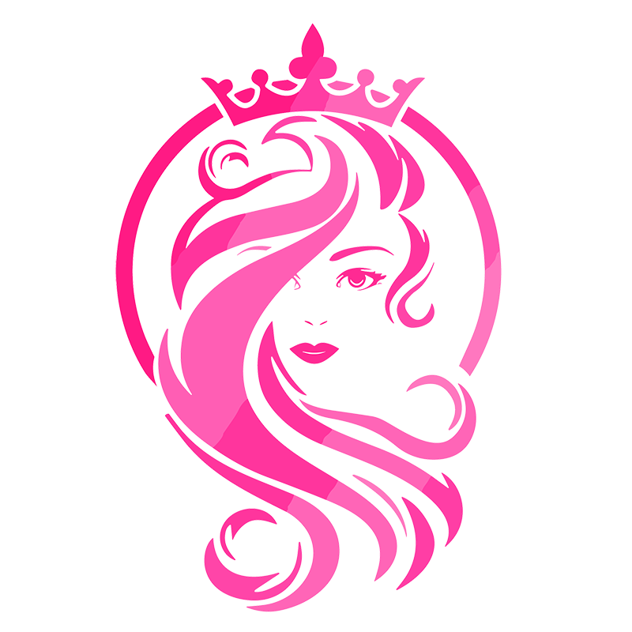
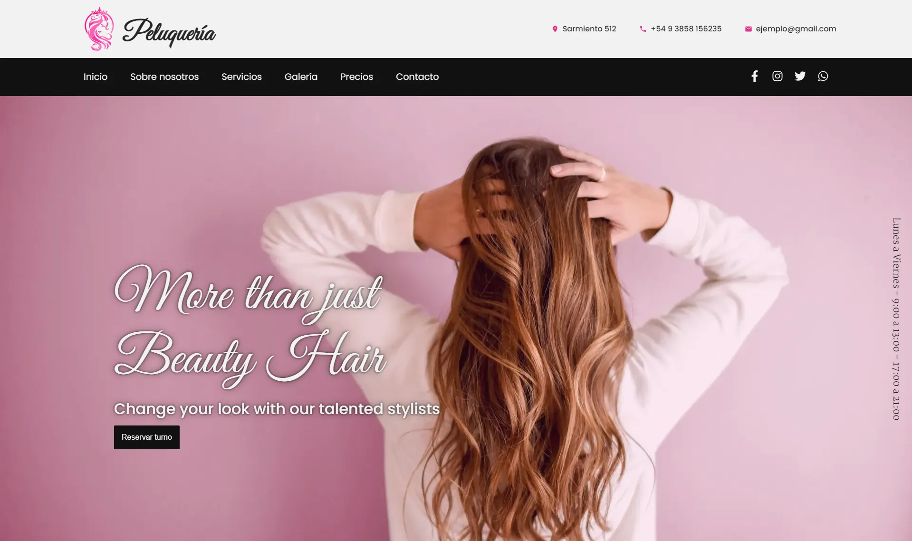

# Landing Page Peluquería

Bienvenido/a a la Mi Peluquería!

    

## Descripción del proyecto

Esta es una landing page para un Salón de Peluquería, donde ofrecen una amplia gama de servicios de belleza capilar. El equipo de estilistas altamente capacitados se dedica a brindar una experiencia excepcional y ayudarte a lucir tu mejor versión. Utilizan productos de alta calidad y técnicas avanzadas para garantizar resultados duraderos y saludables para tu cabello.

## Características principales

- Diseño moderno y atractivo.
- Información detallada sobre nuestros servicios y equipo.
- Galería de imágenes de nuestros trabajos.
- Página web desarrollada con Next.js y Sass para una experiencia de navegación fluida y rápida.
- Integración de Google Maps para facilitar la ubicación y las indicaciones.
- Formulario de contacto en línea para programar citas y consultas.

## Tecnologías utilizadas

- Next Js
- React
- Sass
- Google Maps API

## Capturas de pantalla

    

## Demo

### **Puedes ver la demostración del proyecto [Aqui](https://landing-peluqueria.vercel.app/).**

## Contacto

Si tienes alguna pregunta o consulta, no dudes en ponerte en contacto conmigo:

- **Teléfono:** +54 9 3858 480489
- **Correo electrónico:** abelalejandro.dev@gmail.com
- **Redes sociales:**

    
    
      

